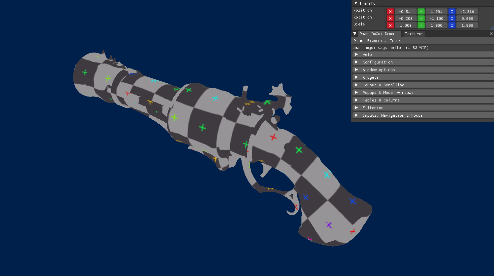
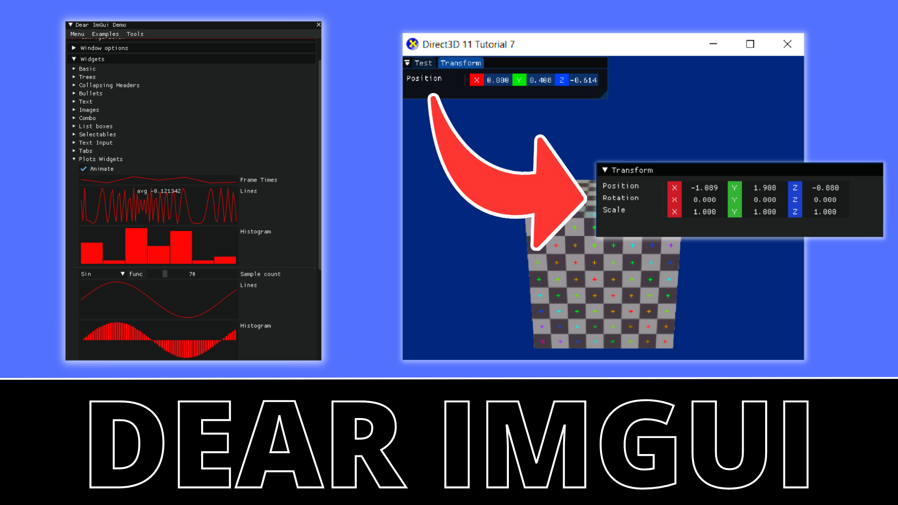

# Heat Blast Engine

DirectX 11 es una API de gráficos utilizada en la industria de los videojuegos y otras aplicaciones multimedia que permite a los desarrolladores crear impresionantes efectos visuales en 3D. Esta API consta de varias clases clave, como Device, Device Context y Texture2D, que ayudan a los desarrolladores a interactuar con el hardware de gráficos de la computadora y crear escenas 3D complejas con facilidad.

Object model loaded from OBJ Loader

Además, el repositorio **[https://github.com/robertocharretonkaplun/DirectX11Sample](https://github.com/robertocharretonkaplun/DirectX11Sample)** incluye dos bibliotecas externas que facilitan aún más el proceso de desarrollo de aplicaciones gráficas. En primer lugar, la biblioteca Imgui es una poderosa herramienta para crear interfaces de usuario interactivas y personalizables. En segundo lugar, la biblioteca OBJ Loader permite a los desarrolladores cargar modelos 3D en sus aplicaciones con facilidad.

En conjunto, estas herramientas hacen que el proceso de desarrollo de aplicaciones gráficas sea más accesible y eficiente para los desarrolladores, permitiéndoles concentrarse en la creación de efectos visuales impresionantes en lugar de dedicar tiempo a crear herramientas y funciones desde cero. Con el uso de DirectX 11 y las bibliotecas Imgui y OBJ Loader, los desarrolladores pueden crear fácilmente aplicaciones gráficas de alta calidad que impresionen a los usuarios con efectos visuales asombrosos.

# IMGUI

El repositorio incluye la biblioteca Imgui Docking, la cual permite a los desarrolladores crear interfaces de usuario interactivas y personalizables de manera sencilla. Esta biblioteca es una herramienta poderosa para mejorar la experiencia del usuario y facilitar el uso de la aplicación. Recomendamos el siguiente video como referencia para [**integrar Imgui Docking**](https://youtu.be/e_VAeIhPN78) en sus proyectos: 

# OBJ Loader